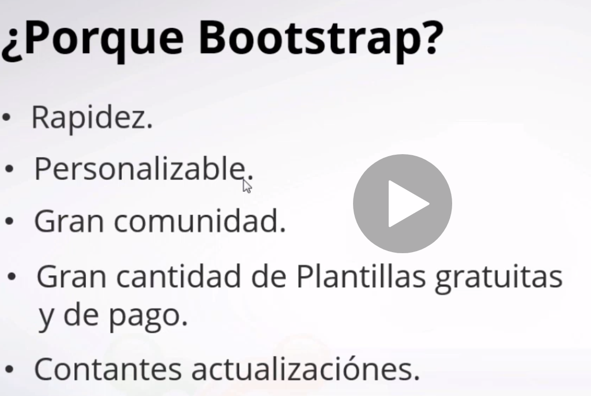

1. [Intro ](#schema1)

# 1. Intro

En este curso vamos aprender desde 0, todos los secretos de `Bootstrap 4`. Conocerás las nuevas actualizaciones, las ventajas de este Framework y porque es uno de los más usados para construir páginas web profesionales. Ademas, crearemos una proyecto web utilizando los componentes más populares que incluye.

# 2. Todo incluido

# 3. Recursos
[Koala](http://koala-app.com/)

# 4. ¿Por qué Bootstrap? y novedades

Rápida y gran comunidad de usuarios 

# 5. Instalación con CDN
Ir a la página [Bootstrap Started](https://getbootstrap.com/docs/5.0/getting-started/introduction/)
Y copiar y pegar el siguiente código:
Esta en la sección `Starter template`
~~~html
<!doctype html>
<html lang="en">
  <head>
    <!-- Required meta tags -->
    <meta charset="utf-8">
    <meta name="viewport" content="width=device-width, initial-scale=1">

    <!-- Bootstrap CSS -->
    <link href="https://cdn.jsdelivr.net/npm/bootstrap@5.0.0-beta3/dist/css/bootstrap.min.css" rel="stylesheet" integrity="sha384-eOJMYsd53ii+scO/bJGFsiCZc+5NDVN2yr8+0RDqr0Ql0h+rP48ckxlpbzKgwra6" crossorigin="anonymous">

    <title>Hello, world!</title>
  </head>
  <body>
    <h1>Hello, world!</h1>

    <!-- Optional JavaScript; choose one of the two! -->

    <!-- Option 1: Bootstrap Bundle with Popper -->
    

    <!-- Option 2: Separate Popper and Bootstrap JS -->
    <!--
    
    
    -->
  </body>
</html>
~~~